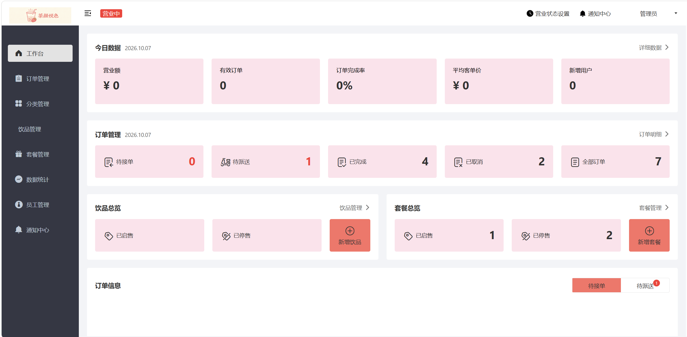
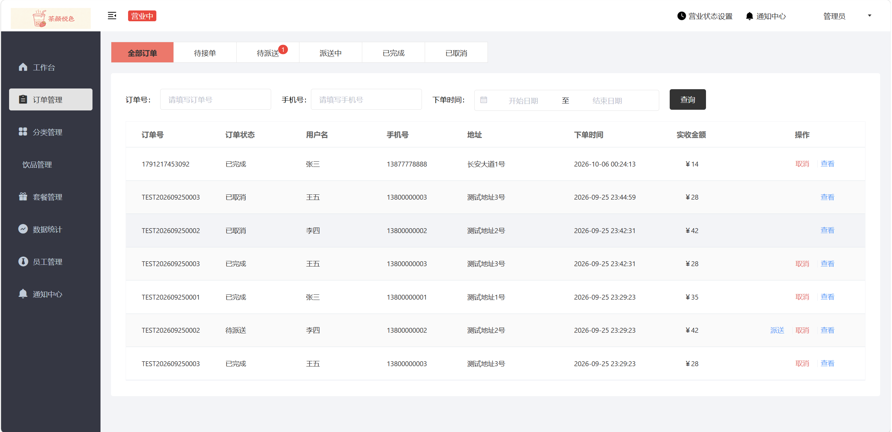
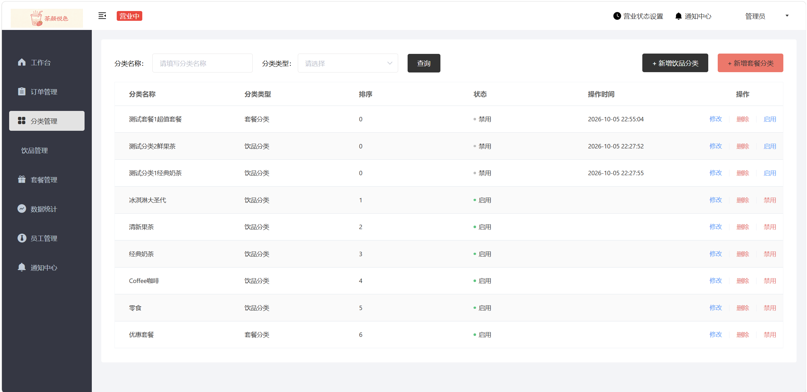
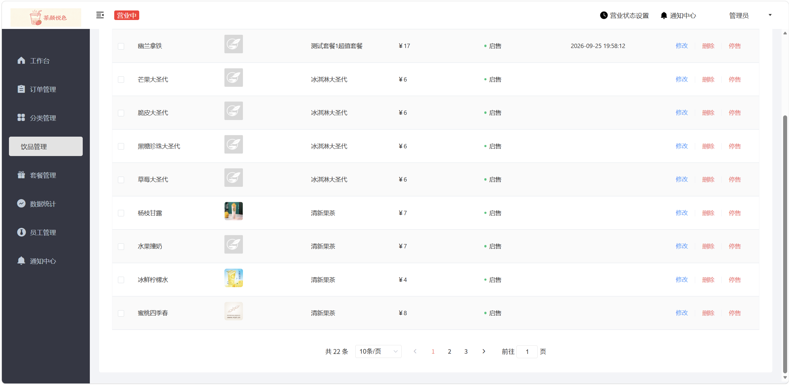
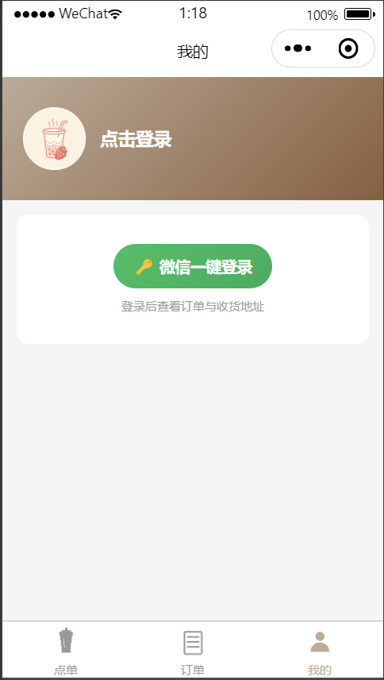
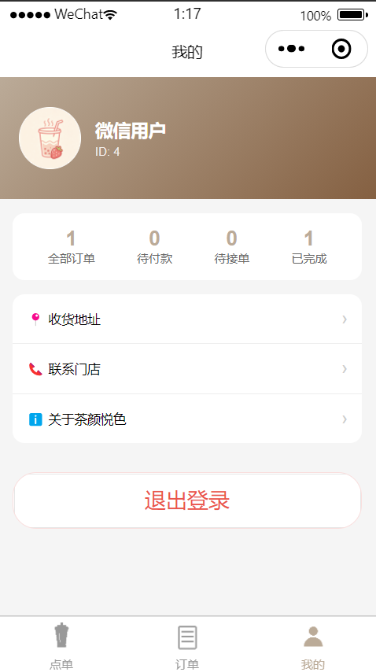
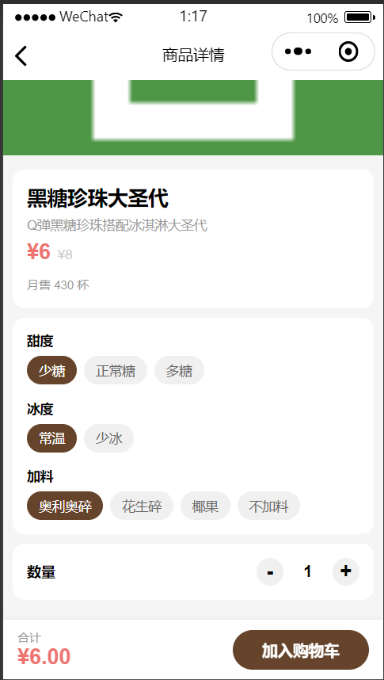
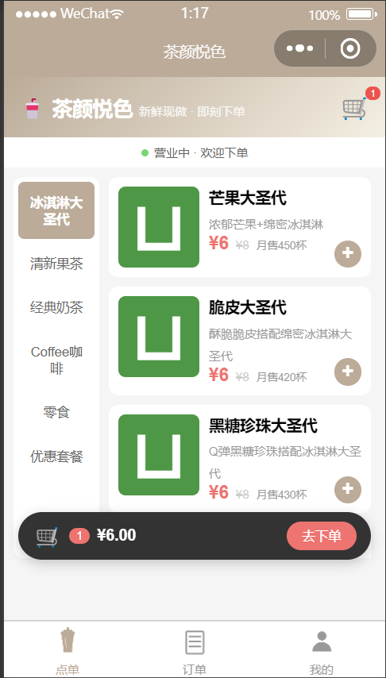
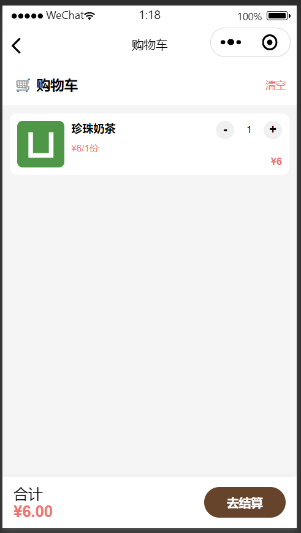
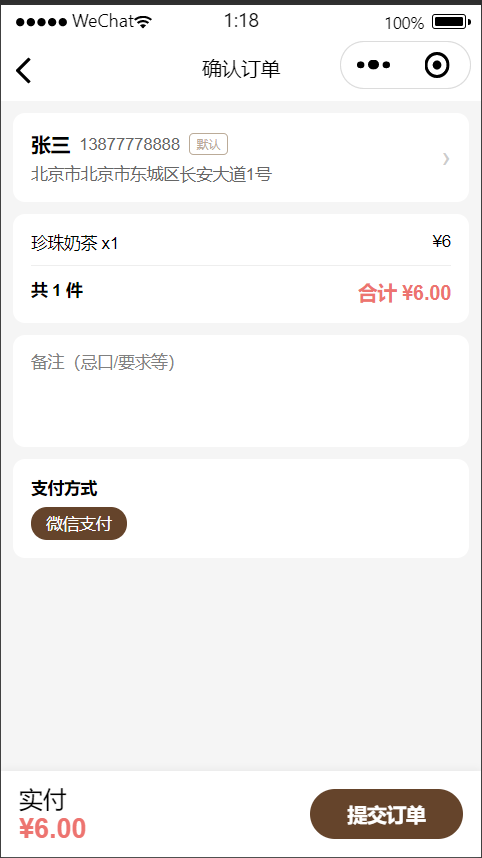

# 茶颜悦色点单系统 TeaSmile

基于 **Spring Boot + uni-app** 的奶茶点单系统，包含三端：

- **C 端小程序**（`Teasmile_hbuilder`）：客户微信小程序，浏览商品、加购、下单、地址与订单管理
- **B 端管理后台**（`teasmile-frontend`）：商家 Web 后台，商品/分类/套餐/订单/员工管理与数据统计
- **服务端**（`teasmile-backend`）：RESTful API，提供用户端与管理端接口

## 效果展示

| | | |
|---|---|---|
|  |  |  |
|  |  |  |
|  |  |  |
|  |  | |

## 技术栈

| 端 | 技术 |
|---|---|
| 后端 | Java 8 / Spring Boot、MyBatis、MySQL、Redis、JWT、WebSocket |
| 管理端前端 | Vue 3 + TypeScript + Element Plus（vue-cli） |
| 小程序端 | uni-app（Vue 3）+ HBuilderX，编译为微信小程序 |

## 目录结构

```
TeaSmile/
├── teasmile-backend/        # 后端服务（Maven 多模块）
│   ├── teasmile-common/     # 公共：工具、常量、异常、结果封装
│   ├── teasmile-pojo/       # 实体、DTO、VO
│   └── teasmile-server/     # 启动模块：controller / service / mapper / 配置
├── teasmile-frontend/       # B 端管理后台（Vue3）
├── Teasmile_hbuilder/       # C 端微信小程序（uni-app，HBuilderX 工程）
└── 数据库/
    └── teasmile.sql         # 数据库初始化脚本
```

## 环境要求

- JDK 8+、Maven 3.6+
- MySQL 5.7 / 8.0
- Redis 5.0+
- Node.js 14+（运行管理端前端）
- HBuilderX（运行/编译小程序）
- 微信开发者工具（预览小程序）
- 微信小程序账号（用于登录，需 AppID / AppSecret）

---

## 部署步骤

### 后端部署

1.运行teasmile.sql脚本

2.在idea打开teasmile-backend文件夹

3.在teasmile-backend/teasmile-server/src/main/resources/ 
    将 `application-dev.example.yml` 复制为 `application-dev.yml`，填入：
   - MySQL 地址、库名、账号、密码
   - Redis 地址、密码
   - 微信小程序 `appid` / `secret`（与小程序端 manifest 的 appid 一致）
   - （可选）阿里云 OSS、微信支付等


### 前端部署
1.在idea打开teasmile-frontend文件夹

2.安装yarn(如果没有)

```shell
npm install yarn -g
```
3.切换淘宝镜像源

```shell
yarn config set registry https://registry.npmmirror.com
```
4.安装依赖

```shell
yarn install
```
5.运行

```shell
yarn serve
```


### 微信小程序快速启动
1.下载微信开发者工具

2.获取个人小程序Appid

3.设置->安全->开放端口


### 小程序项目部署
1.在HBuilder X导入uniapp-hbuilder

2.在manifest.json配置微信小程序Appid

3.在工具->设置->运行配置->微信开发者工具路径中，选择具体的安装路径

4.运行到微信小程序

---


